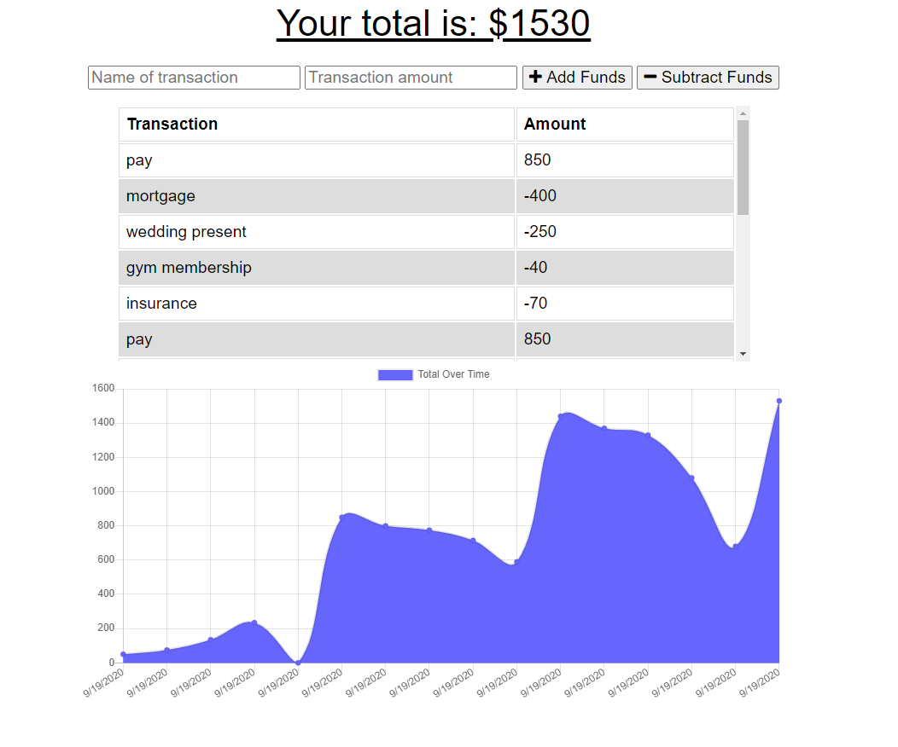

# budget-tracker

The following application is a budget tracker that not only can be downloaded as a progressive web app, but also the user can input data whilst offline with overall budget remaining up to date. 

## Table of Contents

  * [User-Story](#User-Story)

  * [Usage](#usage)

  * [Questions?](#questions)

## User-Story

AS AN avid traveller
I WANT to be able to track my withdrawals and deposits with or without a data/internet connection
SO THAT my account balance is accurate when I am traveling

 

## Usage 
Use the link to find deployed application on heroku:

## Questions?

  GitHub: http://github.com/thomasmaglaris
  Email: thomasmaglaris@gmail.com

Thomas Maglaris. 